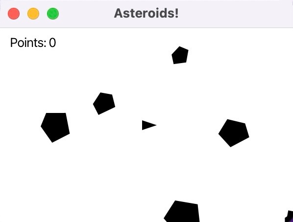

# Asteroids




## 👾 Description
Simple arcade game built with Java and JavaFX. The game is packaged using `jpackage` into a native `.pkg` installer for macOS, allowing you to install and run it just like any other desktop application — **no need to install Java or JavaFX separately**.

## 🎮 Features

- Classic arcade-style gameplay
- JavaFX-based GUI and animation
- Native macOS `.pkg` installer
- No external dependencies for users
- Built with Maven for easy development and packaging

## 📦 Installation

1. **Download the installer**  
   Go to the [Releases](https://github.com/joherrer/asteroids/releases) page and download the latest `.pkg` installer for macOS.

2. **Install the game**  
   Double-click the `.pkg` file to install the game like any other macOS app.

3. **Play!**  
   Launch "Asteroids Game" from your Applications folder.

No need to install Java or JavaFX — everything is bundled.

## 🛠️ Developer Setup

The game is not a final version. If you're a developer and want to modify and improve the game, please contact me before forking the repository, and submit a pull request with your improvements. Follow these steps:

### Prerequisites

- Java Development Kit (JDK) 21 or later
- Maven
- JavaFX SDK
- JavaFX jmods

### Clone the repository

```bash
git clone https://github.com/Joherrer/asteroids.git
cd asteroids
```

### Build and Run with Maven

```bash
mvn clean package
mvn javafx:run
```
### Create runtime with JLink

```bash
jlink \
  --module-path "$JAVA_HOME/jmods:/path/to/your/javafx-jmods-21.0.7" \
  --add-modules java.base,java.desktop,javafx.controls,javafx.fxml \
  --output runtime \
  --no-header-files \
  --no-man-pages
```

### Package the app with JPackage

```bash
jpackage \
  --name Asteroids \
  --app-version 1.0.0 \
  --type pkg \
  --input target \
  --main-jar asteroids-1.0.0-SNAPSHOT.jar \
  --main-class io.github.joherrer.asteroids.AsteroidsApplication \
   --runtime-image runtime \
  --icon packaging/icon.icns \
  --vendor "Herrera Software"
```

## License
Copyright (c) 2025 Jose Herrera. All rights reserved.